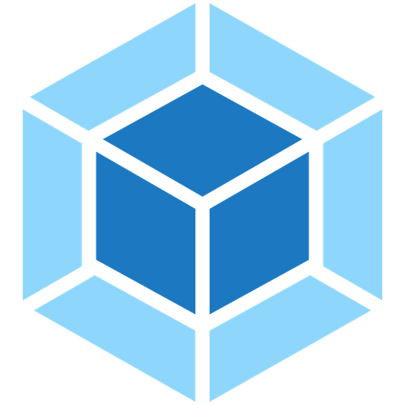

### Hi there, I'm Vlad Yanukovich
### I`m Front-End Developer from Belarus

- 🧠 I`m trying to be better in front-end development.
- ❤️ Love beautiful design and all beautiful around the UI and not only.
- 👯 I expanding my LinkedIn network. Add me there. Link below.
- 🥅 2021/2022 Goals: find new job in front-end.
- 🎵 I want to share my Spotify playlist (I dont know why I`m doing this). [Click here!][spotify]

---

### Contact with me and my Social Links:

[][telegram] 

[][linkedin]
[][instagram]

 
 

> *If you use addblocker, please, turn off this extension on the page.*

---

### Technologies and Tools:

 
 

---

### I want to learn in the future:

 
 

---

### My Github Stats:

[gmail]: baddesinger5@gmail.com
[instagram]: https://www.instagram.com/vlad_drumstick/
[linkedin]: https://www.linkedin.com/in/vlad-yanukovich-177a67199/
[telegram]: https://t.me/vlad_is_love6
[spotify]: https://open.spotify.com/playlist/3EiTNbX1cpSv0oAHusSTVa
